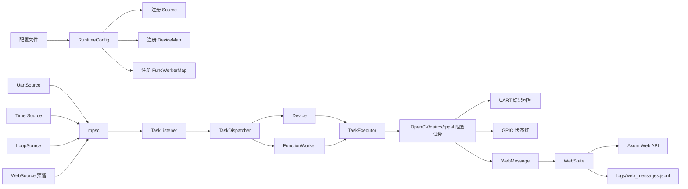

# RuboVision Engine

RuboVision Engine 是一个面向嵌入式视觉小车/机器人任务的 Rust 运行框架。项目当前的核心目标是把“电控指令、视觉设备、识别函数、Web 调试、串口/GPIO 回执”拆成可配置、可扩展的运行链路，让视觉任务不再写死在主循环中，而是由配置决定触发源、设备和函数。

当前工程采用新版消息链路：

```text
Source -> TaskListener -> TaskDispatcher -> TaskExecutor -> WebMessage
```

也可以从系统职责角度理解为：

```text
配置文件
  -> 注册触发源 Source
  -> 注册设备 Device
  -> 注册功能函数 Function
  -> Source 产生 Event
  -> TaskListener 接收 Event
  -> TaskDispatcher 根据 Event 找到 Device + Function
  -> TaskExecutor 在线程池中执行阻塞视觉/硬件任务
  -> 结果写回 Web 调试面板、UART、GPIO 状态灯或日志
```

> 说明：Cargo 包名目前是 `new_car`，但工程语义和文档名称统一使用 `RuboVision Engine`。

## 项目当前状态

项目已经从旧版硬编码主循环迁移到配置驱动的任务框架。目前已能完成以下工作：

- 通过 UART 接收电控指令，并根据 `config/bindings.toml` 映射到具体任务。
- 根据配置注册摄像头设备，统一使用 `Camera` 设备模型。
- 根据配置注册功能函数，包括颜色识别、二维码识别、路口识别占位函数和调试函数。
- 执行颜色识别：摄像头读取、圆形 ROI、HSV 阈值筛选、面积比例判断、连续稳定计数。
- 执行二维码识别：摄像头读取、灰度预处理、`quircs` 解码、整数 payload 解析。
- 将识别结果通过全局 UART 配置写回电控端。
- 在任务执行期间控制 GPIO 状态灯，任务结束后自动恢复高电平。
- 将任务结果写入 Web 消息通道，并通过 Axum 提供 Web 调试面板。
- Web 结果支持内存缓存、最近历史记录、JSONL 持久化和启动恢复。
- Web 关闭时会 drain 消息并写日志，避免执行端因为无人消费结果而阻塞。

当前仍处于继续迭代阶段，主要未完成项包括：

- `cross_detect` 只是占位实现，目前固定返回 `"0"`，还没有接入真实黑色轮廓/路口识别算法。
- `WebSource` 已保留结构，但暂未实现从 Web 主动触发任务的能力。
- `TimerSource` 和 `LoopSource` 已有基础事件发送能力，但还不是完整的任务调度器。
- 设备和函数查找目前对未知 ID 使用 `panic!`，后续应改成可恢复错误并回传 WebMessage。
- 摄像头当前按任务打开，后续可考虑设备生命周期统一管理、复用和并发控制。
- 配置字段命名仍有历史包袱，后续可以做一次结构整理和兼容迁移。

## 技术栈

| 类别 | 技术/依赖 | 用途 |
| --- | --- | --- |
| 语言 | Rust 2024 Edition | 主程序、异步运行、硬件控制、Web 服务 |
| 异步运行时 | `tokio` | Source、Listener、Web 服务、通道、任务调度 |
| Web 框架 | `axum` | Web 调试面板和消息接口 |
| 配置加载 | `config`、`serde`、`serde_yaml`、`toml` | 多配置文件加载和反序列化 |
| 日志 | `tracing`、`tracing-subscriber`、`tracing-appender`、`log` | 控制台日志和文件日志 |
| 静态资源 | `rust-embed` | 编译期嵌入 `static/` 目录 |
| 视觉处理 | `opencv` | 摄像头读取、颜色空间转换、ROI、阈值、图像处理 |
| 二维码 | `quircs` | QR Code 识别和解码 |
| 硬件 I/O | `rppal` | UART 和 Raspberry Pi GPIO 控制 |
| 数据编码 | `base64` | Web 图片 data URL 辅助工具 |
| 错误处理 | `anyhow` | 运行时错误上下文 |

## 目录结构总览

```text
.
├── Cargo.toml
├── Cargo.lock
├── README.md
├── TaskTODO.md
├── config/
│   ├── app.yaml
│   ├── web.yaml
│   ├── bindings.toml
│   ├── device.toml
│   └── func_param.toml
├── src/
│   ├── main.rs
│   ├── lib.rs
│   ├── embed.rs
│   ├── config/
│   ├── device/
│   ├── func/
│   ├── init/
│   ├── source/
│   ├── utils/
│   └── web/
├── static/
│   ├── index.html
│   ├── image/
│   │   ├── a.jpg
│   │   └── b.jpg
│   └── project/
│       └── banner.txt
├── reports/
│   └── midterm/
│       ├── RuboVision-Engine-midterm-report.pptx
│       ├── RuboVision-Engine-midterm-report-v2.pptx
│       ├── preview/
│       └── assets/
├── logs/
└── target/
```

### 根目录文件

| 路径 | 说明 |
| --- | --- |
| `Cargo.toml` | Rust 包配置和依赖列表。当前包名为 `new_car`，edition 为 `2024`。 |
| `Cargo.lock` | 依赖锁定文件，用于保证构建版本稳定。 |
| `README.md` | 项目说明文档。 |
| `TaskTODO.md` | 开发记录和后续任务备忘，包含 2026-05-12 新架构迁移记录。 |
| `config/` | 运行时配置目录，决定应用、Web、触发源、设备、函数参数。 |
| `src/` | Rust 主源码目录。 |
| `static/` | Web 调试面板和嵌入式静态资源。 |
| `reports/` | 中期汇报 PPT、PDF 预览和相关图片资产。 |
| `logs/` | 运行时日志目录，包括 `rubovision.log.YYYY-MM-DD` 和 `web_messages.jsonl`。 |
| `target/` | Cargo 构建输出目录，不属于源码。 |

## 配置系统

程序启动时调用 `config::load_config()`，按顺序加载：

```text
config/app
config/web
config/bindings
config/func_param
config/device
RUBO_* 环境变量覆盖
```

最终反序列化成 `RuntimeConfig`：

```rust
pub struct RuntimeConfig {
    pub app: AppConfig,
    pub web: WebConfig,
    pub bindings: BindingsConfig,
    pub func_param_config: FuncParamConfig,
    pub device_param_config: DeviceParamConfig,
}
```

### `config/app.yaml`

```yaml
app:
  name: rubovision
  profile: dev
  log_level: info
```

当前主要用于保存应用基础信息。代码中的日志过滤器目前固定为 `info`，后续可以把 `log_level` 真正接入 `tracing_subscriber::EnvFilter`。

### `config/web.yaml`

```yaml
web:
  on: true
  host: 127.0.0.1
  port: 3000
```

字段说明：

| 字段 | 说明 |
| --- | --- |
| `on` | 是否开启 Web 调试面板。为 `false` 时，任务消息会被消费并写日志。 |
| `host` | Web 服务监听地址。 |
| `port` | Web 服务监听端口。 |

默认访问地址：

```text
http://127.0.0.1:3000
```

### `config/bindings.toml`

`bindings.toml` 决定“哪个触发源命中哪个命令后，调用哪个设备和哪个函数”。

当前默认 UART 绑定：

```toml
[[bindings.uart_source]]
task_id = "uart_color_detect"
source_key = "a1"
device_id = "color_camera"
function_id = "color_detect"

[[bindings.uart_source]]
task_id = "uart_qr_detect"
source_key = "b2"
device_id = "qr_camera"
function_id = "qr_detect"
```

含义：

| UART 指令 | 任务 ID | 设备 | 函数 | 当前效果 |
| --- | --- | --- | --- | --- |
| `a1` | `uart_color_detect` | `color_camera` | `color_detect` | 进行颜色识别，并把颜色名写回串口和 Web |
| `b2` | `uart_qr_detect` | `qr_camera` | `qr_detect` | 进行二维码识别，并把数字结果写回串口和 Web |

绑定项字段说明：

| 字段 | 说明 |
| --- | --- |
| `task_id` | 任务标识，主要用于日志和事件追踪。 |
| `source_key` | Source 收到的触发 key，例如 UART 命令 `a1`。 |
| `device_id` | 要使用的设备 ID，必须在 `device.toml` 中注册。 |
| `function_id` | 要执行的函数 ID，必须在 `func_param.toml` 中注册。 |

除 `uart_source` 外，配置结构还预留了：

- `timer_source`：一次性发送配置中的事件。
- `loop_source`：启动后先发送一次配置事件，之后每 5 秒发送 `DebugEvent("debug")`。
- `web_source`：为 Web 触发任务保留，目前尚未实现。

### `config/device.toml`

`device.toml` 决定全局 UART 参数和设备实例。

当前全局 UART：

```toml
[device_param_config.uart_config]
serial = "/dev/ttyV0"
baud = 9600
data_bit = 8
stop_bit = 1
parity_bit = false
```

这份 UART 配置是进程级唯一配置，当前有两个用途：

- `UartSource` 监听电控端发来的命令。
- 视觉函数执行结束后通过同一份配置写回识别结果。

当前设备列表：

```toml
[[device_param_config.device_config_list]]
device_id = "color_camera"
kind = "Camera"
args = [
    "path=/dev/video2",
]

[[device_param_config.device_config_list]]
device_id = "qr_camera"
kind = "Camera"
args = [
    "path=/dev/video4",
]

[[device_param_config.device_config_list]]
device_id = "cross_camera"
kind = "Camera"
args = [
    "path=/dev/video2",
]
```

设备字段说明：

| 字段 | 说明 |
| --- | --- |
| `device_id` | 设备唯一 ID，供 `bindings.toml` 引用。 |
| `kind` | 设备类型。当前支持 `Camera`。 |
| `args` | 设备参数，当前 `Camera` 需要 `path=/dev/videoX`。 |

当前设备抽象中，摄像头设备除了保存 `path`，还持有一份克隆后的全局 UART 配置，方便函数执行结束时进行串口回写。

### `config/func_param.toml`

`func_param.toml` 决定启动时注册哪些函数、函数返回通道和函数参数。

函数项结构：

```toml
[[func_param_config.func_param_list]]
function_id = "color_detect"
returns = { web = true, gpio = true }
args = [
    "debug_model=false",
]
```

字段说明：

| 字段 | 说明 |
| --- | --- |
| `function_id` | 函数唯一 ID，供 `bindings.toml` 引用。 |
| `returns.web` | 是否把函数结果发送到 WebMessage 通道。 |
| `returns.gpio` | 是否在函数执行期间启用 GPIO 状态灯。 |
| `args` | 函数参数，使用 `key=value` 字符串形式。 |

当前注册函数：

| 函数 ID | 状态 | 说明 |
| --- | --- | --- |
| `color_detect` | 已实现 | 颜色识别，返回颜色名。 |
| `qr_detect` | 已实现 | 二维码识别，返回二维码中的整数。 |
| `cross_detect` | 占位 | 当前固定返回 `"0"`。 |
| `debug_fun` | 已实现 | 调试函数，模拟耗时并返回调试文本。 |

#### 颜色识别参数

```toml
args = [
    "debug_model=false",
    "loop_count=5",
    "radius_ratio=0.4",
    "detect_area_access_rate=0.8",
    "color.red=0,50,160,255,110,255",
    "color.blue=100,137,124,255,56,255",
    "color.green=50,100,91,255,85,255",
    "color.black=0,179,0,255,0,76",
    "color.white=0,170,0,55,120,255",
    "color_light_pin=17",
    "qr_light_pin=22",
    "gpio_light_pin=27",
]
```

参数说明：

| 参数 | 说明 |
| --- | --- |
| `debug_model` | 是否开启 OpenCV 调试窗口。开启时会显示识别画面，按 `q` 或 `Esc` 可退出。 |
| `loop_count` | 连续多少帧识别到同一颜色后才认为结果稳定。 |
| `radius_ratio` | 圆形 ROI 半径比例，基于画面宽高中较小值计算。 |
| `detect_area_access_rate` | 颜色面积比例阈值。超过阈值才判定为该颜色，否则返回 `unknown`。 |
| `color.<name>` | HSV 范围，格式为 `H_min,H_max,S_min,S_max,V_min,V_max`。颜色数量由配置条目数量决定。 |
| `color_light_pin` | 颜色任务状态灯 GPIO 引脚。 |
| `qr_light_pin` | 二维码任务状态灯 GPIO 引脚。 |
| `gpio_light_pin` | 全局运行状态灯 GPIO 引脚。 |

#### 二维码识别参数

```toml
args = [
    "debug_model=false",
    "color_light_pin=17",
    "qr_light_pin=22",
    "gpio_light_pin=27",
]
```

二维码识别会把画面转灰度后交给 `quircs` 解码。当前二维码 payload 必须能解析为整数，否则会返回错误 WebMessage。

#### GPIO 返回行为

当 `returns.gpio = true` 时：

- 任务开始时拉低 `gpio_light_pin`。
- 根据任务类型拉低 `color_light_pin` 或 `qr_light_pin`。
- 任务结束后 `LightSession` 被 drop，所有相关引脚恢复高电平。

这相当于用 Rust 的 RAII 机制保证任务结束时恢复灯光状态。

## 启动流程

程序入口是 `src/main.rs`：

```rust
use new_car::run;

#[tokio::main]
async fn main() {
    let _ = run().await;
}
```

真正的运行逻辑在 `src/lib.rs::run()`：

1. 初始化日志系统。
2. 加载配置文件，得到 `RuntimeConfig`。
3. 打印嵌入式 banner。
4. 创建 `mpsc::channel<Event>(32)`，注册各类 Source。
5. 根据配置注册函数表 `FuncWorkerMap`。
6. 根据配置注册设备表 `DeviceMap`。
7. 创建 `mpsc::channel<WebMessage>(32)`，启动 `TaskListener`。
8. 如果 Web 开启，启动 Axum Web 服务并消费 WebMessage。
9. 如果 Web 关闭，启动消息 drain 任务，避免执行端阻塞。
10. 主任务等待 `Ctrl-C` 退出。

## 核心架构

### 整体架构图



### Source 层

Source 层负责把外部触发转换成统一的 `Event`。

核心 trait 在 `src/source/traits.rs`：

```rust
pub trait Source {
    fn base(&self) -> &BaseSource;
    fn base_mut(&mut self) -> &mut BaseSource;
    fn set_sender(&mut self, tx: Sender<Event>);
    fn get_sender(&self) -> Option<&Sender<Event>>;
    async fn send(&self, event: Event) -> Result<(), SendError<Event>>;
}
```

事件类型：

```rust
pub enum Event {
    UsualEvent(String, String, String),
    DebugEvent(String),
    OtherEvent(String),
}
```

`UsualEvent` 当前三个字段依次表示：

```text
task_id, function_id, device_id
```

当前 Source 实现：

| Source | 文件 | 当前能力 |
| --- | --- | --- |
| `UartSource` | `src/source/source_uart.rs` | 打开 UART，读取命令，根据 `source_key` 映射为 `UsualEvent`。 |
| `TimerSource` | `src/source/source_timer.rs` | 启动时发送配置中的一次性事件。 |
| `LoopSource` | `src/source/source_loop.rs` | 启动时发送配置事件，之后每 5 秒发送调试事件。 |
| `WebSource` | `src/source/source_web.rs` | 结构已保留，目前 TODO。 |

#### UART 命令解析

`UartSource` 使用全局 UART 配置打开串口，然后循环读取数据：

- 支持 `\n` 或 `\r` 分隔命令。
- 如果缓冲区内容刚好匹配某个 `source_key`，即使没有换行也会分发。
- 未知命令会被忽略并写入日志。
- 缓冲区超过 256 字符会清空，避免异常输入长期累积。

### TaskListener 层

`TaskListener` 在 `src/init/task_listen.rs`。

职责很单纯：

1. 从 `mpsc::Receiver<Event>` 中等待事件。
2. 收到事件后交给 `TaskDispatcher` 找设备和函数。
3. 为每个事件启动一个异步任务。
4. 调用 `TaskExecutor` 执行具体函数。

因为每个事件会 `tokio::spawn`，所以多个任务可以并发进入执行阶段。真正的阻塞视觉逻辑会继续通过 `spawn_blocking` 放到阻塞线程池。

### TaskDispatcher 层

`TaskDispatcher` 在 `src/init/task_dispatch.rs`。

它持有：

```rust
pub struct TaskDispatcher {
    func_worker_map: FuncWorkerMap,
    device_map: DeviceMap,
}
```

职责：

- 对 `UsualEvent`，根据 `device_id` 从 `DeviceMap` 取设备。
- 对 `UsualEvent`，根据 `function_id` 从 `FuncWorkerMap` 构造 `FunctionWorker`。
- 对 `DebugEvent`，直接构造 `debug_fun`，设备使用 `Device::None`。

### TaskExecutor 层

`TaskExecutor` 在 `src/init/task_exec.rs`。

执行方式：

```rust
let (result, returns) = tokio::task::spawn_blocking(move || execute_sync(device, func))
    .await??;
```

这样设计的原因是 OpenCV 摄像头读取、二维码识别、UART、GPIO 都可能是阻塞操作。把它们放进 `spawn_blocking` 可以避免堵住 Tokio 异步调度线程。

函数执行完成后：

- 如果 `returns.web = true`，发送 `WebMessage` 到 Web 通道。
- 如果 `returns.web = false`，只写日志。

### Device 层

设备层在 `src/device/`。

当前设备枚举：

```rust
pub enum Device {
    Camera(CameraDevice),
    None,
}
```

当前支持的真实设备：

| 设备 | 结构 | 说明 |
| --- | --- | --- |
| `Camera` | `CameraDevice` | 保存摄像头路径和 UART 回写配置。 |
| `None` | 无设备 | 用于调试函数或不需要硬件设备的任务。 |

设备注册入口：

```rust
register_device(config: DeviceParamConfig) -> DeviceMap
```

设备工厂当前只支持：

```rust
match kind {
    "Camera" => register_camera(args, uart),
    _ => panic!("unknown device kind `{kind}`"),
}
```

因此新增设备时需要同时扩展：

- `src/device/traits.rs` 的 `Device` 枚举。
- `src/device/register.rs` 的 `device_factory`。
- 对应设备配置解析和执行逻辑。

### Function 层

函数层在 `src/func/`。

核心类型：

```rust
pub type Function = fn(&[String], &Device, &FuncReturnConfig) -> WebMessage;
```

函数注册流程：

```text
func_param.toml
  -> FuncParamConfig
  -> register_func()
  -> function_factory()
  -> FuncWorkerMap
```

`FunctionDef` 保存函数定义，`FunctionWorker` 是每次执行时构造出来的工作单元。这样配置里的 `args` 和 `returns` 会随函数一起进入执行阶段。

当前函数工厂：

| `function_id` | Rust 函数 | 说明 |
| --- | --- | --- |
| `debug_fun` | `fn_debug` | 调试函数。 |
| `color_detect` | `fn_color_detect` | 颜色识别包装函数。 |
| `qr_detect` | `fn_qr_detect` | 二维码识别包装函数。 |
| `cross_detect` | `fn_cross_detect` | 路口识别包装函数，底层暂为占位。 |

视觉函数的包装逻辑在 `src/func/usual.rs`，主要负责：

- 从 `Device::Camera` 构造对应识别配置。
- 构造 `ResponseDeviceConfig`。
- 根据 `returns.gpio` 开启 GPIO 灯光 session。
- 调用底层视觉算法。
- 将结果写回 UART。
- 生成 `WebMessage`。

## 视觉算法模块

视觉模块在 `src/device/vision/`。

```text
src/device/vision/
├── camera.rs
├── color.rs
├── config.rs
├── cross.rs
├── qr.rs
├── response.rs
└── tests.rs
```

### 摄像头打开

`camera.rs` 使用 OpenCV V4L2 后端打开摄像头：

```rust
videoio::VideoCapture::from_file(path, videoio::CAP_V4L2)
```

颜色识别和二维码识别都通过配置中的 `CameraDevice.path` 打开对应设备。

### 颜色识别

入口：

```rust
run_color_detect(config: &ColorDetectConfig) -> Result<String>
```

处理流程：

1. 打开摄像头。
2. 循环读取帧。
3. 跳过空帧。
4. 根据 `radius_ratio` 在画面中心生成圆形 ROI mask。
5. 对每个 `color.<name>` 的 HSV 范围生成颜色 mask。
6. 计算颜色 mask 在圆形 ROI 内的面积比例。
7. 选出比例最高的颜色。
8. 如果最高比例小于 `detect_area_access_rate`，判定为 `unknown`。
9. 如果连续 `loop_count` 帧结果一致，返回最终颜色名。

颜色识别输出：

- Web 文本：`color_detect finished: <color>; serial=sent`
- 串口回写：`<color>\n`

可能的颜色结果来自配置，例如：

```text
red
blue
green
black
white
unknown
```

### 二维码识别

入口：

```rust
run_qr_detect(config: &QrDetectConfig) -> Result<i32>
```

处理流程：

1. 打开摄像头。
2. 循环读取帧。
3. 跳过空帧。
4. 将 BGR 图像转为灰度图。
5. 使用 `quircs` 识别二维码。
6. 解码 payload。
7. 将 payload 按整数解析。
8. 返回解析出的任务编号。

二维码识别输出：

- Web 文本：`qr_detect finished: <number>; serial=sent`
- 串口回写：`<number>\n`

如果二维码内容不是整数，函数会返回错误 WebMessage，例如：

```text
qr_detect failed: qr payload is not an integer: <payload>
```

### 路口识别

入口：

```rust
run_cross_detect(config: &CrossDetectConfig) -> Result<String>
```

当前状态：

- 已有配置结构。
- 已有函数注册链路。
- 已有 `cross_camera` 默认设备。
- 底层实现暂时固定返回 `"0"`。

后续可以在这里接入黑线、十字、T 字、岔路等轮廓识别逻辑。

### 结果回写和 GPIO

`response.rs` 负责：

- UART 参数校验。
- 打开 UART。
- 写入结果并追加换行。
- GPIO 引脚拉低/恢复。

UART 参数校验包括：

- `serial` 不能为空。
- `baud` 必须大于 0。
- `data_bit` 必须在 `5..=8`。
- `stop_bit` 必须为 `1` 或 `2`。

GPIO 通过 `LightSession` 管理。`LightSession` drop 时会把所有已控制的引脚恢复为高电平。

## Web 调试系统

Web 模块在 `src/web/`。

```text
src/web/
├── error.rs
├── handler.rs
├── main.rs
├── model.rs
├── mod.rs
├── router.rs
└── state.rs
```

### 路由

| 方法 | 路径 | 说明 |
| --- | --- | --- |
| `GET` | `/` | 返回嵌入式 `static/index.html`。 |
| `GET` | `/message` | 返回最新一条消息；如果没有消息，返回 204 风格空消息。 |
| `POST` | `/message` | 接收外部推送的 `WebMessage` 并写入状态。 |
| `GET` | `/history` | 返回最近历史消息列表。 |
| 任意 | fallback | 返回 404。 |

### WebMessage 数据结构

```rust
pub struct WebMessage {
    pub id: u64,
    pub created_at_ms: u64,
    pub code: u16,
    pub text: String,
    pub image: Option<String>,
}
```

字段说明：

| 字段 | 说明 |
| --- | --- |
| `id` | 运行时自动补充的递增 ID。 |
| `created_at_ms` | 运行时自动补充的毫秒时间戳。 |
| `code` | 消息状态码，成功通常为 `200`，错误为 `500`，空消息为 `204`。 |
| `text` | 消息文本。 |
| `image` | 可选图片，可以是普通路径或 data URL。 |

### WebState

`WebState` 负责保存 Web 消息状态：

- `latest`：最新消息。
- `history`：最近历史，默认上限为 20。
- `next_id`：消息自增 ID。
- `persistence_tx`：异步持久化写入通道。

持久化文件：

```text
logs/web_messages.jsonl
```

启动时会读取该文件，恢复最近 20 条有效历史记录。写入时使用 JSON Lines，每一行是一条 `WebMessage`。

### 前端页面

前端页面是 `static/index.html`，通过 `rust-embed` 编译进二进制。

页面能力：

- 展示当前最新消息。
- 展示状态码、文本、图片状态。
- 轮询 `/message`，默认 1500ms。
- 轮询 `/history`，默认 3000ms。
- 显示请求总数、空消息数、无效请求数、有效记录数、历史拉取次数。
- 展示最近 20 条有效消息。
- 支持手动开始/停止请求、立即刷新消息、立即同步历史、清空本地视图。

## 日志系统

日志初始化在 `src/init/logger.rs`。

当前日志输出到两个位置：

- 控制台：带 ANSI 颜色，便于开发调试。
- 文件：按天滚动写入 `logs/rubovision.log.YYYY-MM-DD`。

Web 消息额外写入：

```text
logs/web_messages.jsonl
```

这些日志对排查以下问题很重要：

- 配置是否加载成功。
- Source 是否注册成功。
- UART 是否正常打开。
- 命令是否命中绑定。
- 任务是否进入执行。
- 视觉函数是否返回错误。
- Web 消息是否被消费和持久化。

## 运行方式

### 环境要求

建议运行环境：

- Linux 或 Raspberry Pi OS。
- Rust toolchain，支持 Rust 2024 edition。
- 系统安装 OpenCV 开发库。
- 可访问的摄像头设备，例如 `/dev/video2`、`/dev/video4`。
- 可访问的串口设备，例如 `/dev/ttyV0`。
- 如果启用 GPIO，需要在 Raspberry Pi 或兼容环境运行，并具备 GPIO 访问权限。

### 构建

```bash
cargo build
```

发布构建：

```bash
cargo build --release
```

### 运行

```bash
cargo run
```

运行后默认：

- UART 监听 `/dev/ttyV0`。
- Web 面板监听 `127.0.0.1:3000`。
- 日志写入 `logs/`。
- 按 `Ctrl-C` 退出。

打开 Web 面板：

```text
http://127.0.0.1:3000
```

### 测试

```bash
cargo test
```

注意：

- 部分测试依赖本机 OpenCV 编译环境。
- UART 虚拟串口测试会尝试使用 `socat`；如果系统没有 `socat`，测试会跳过相关场景。
- `test_run` 和 Web 长运行测试被标记为 `#[ignore]`，不会在普通 `cargo test` 中运行。

运行被忽略的测试需要显式指定：

```bash
cargo test -- --ignored
```

这类测试会启动长运行服务或等待 `Ctrl-C`，一般只在手工调试时使用。

## 默认任务结果

### UART 指令 `a1`

链路：

```text
UART 收到 a1
  -> UartSource
  -> Event::UsualEvent("uart_color_detect", "color_detect", "color_camera")
  -> color_camera (/dev/video2)
  -> color_detect
  -> OpenCV 颜色识别
  -> 串口写回颜色名
  -> WebMessage
```

典型结果：

```text
串口：red
Web：color_detect finished: red; serial=sent
```

如果没有任何颜色达到面积比例阈值，可能返回：

```text
unknown
```

### UART 指令 `b2`

链路：

```text
UART 收到 b2
  -> UartSource
  -> Event::UsualEvent("uart_qr_detect", "qr_detect", "qr_camera")
  -> qr_camera (/dev/video4)
  -> qr_detect
  -> OpenCV 灰度预处理 + quircs 解码
  -> 串口写回整数任务号
  -> WebMessage
```

典型结果：

```text
串口：3
Web：qr_detect finished: 3; serial=sent
```

### `cross_detect`

当前链路已通，但算法未完成：

```text
Web：cross_detect finished: 0
```

它适合作为后续路口识别算法的接入点。

## 文件结构详解

### `src/main.rs`

二进制入口。只负责启动 Tokio runtime 并调用 `new_car::run()`。

### `src/lib.rs`

运行时总入口，负责把所有模块串起来：

- 初始化日志。
- 加载配置。
- 注册 Source。
- 注册 Function。
- 注册 Device。
- 启动 TaskListener。
- 启动 Web 调试服务或消息 drain 任务。
- 等待 `Ctrl-C`。

### `src/config/`

配置模型和加载逻辑。

| 文件 | 说明 |
| --- | --- |
| `mod.rs` | 模块导出。 |
| `settings.rs` | `load_config()` 和 `RuntimeConfig`。 |
| `app.rs` | `AppConfig`。 |
| `web.rs` | `WebConfig`。 |
| `binding.rs` | `BindingsConfig` 和各类 Source Binding。 |
| `device.rs` | `DeviceParamConfig`、`DeviceParam`、`UartParam`。 |
| `func.rs` | `FuncParamConfig`、`FuncParam`、`FuncReturnConfig`。 |

### `src/source/`

触发源模块，把外部输入转换为统一事件。

| 文件 | 说明 |
| --- | --- |
| `traits.rs` | `Event`、`Source` trait、`BaseSource`。 |
| `source_uart.rs` | UART 命令监听和分发。 |
| `source_timer.rs` | 一次性定时源。 |
| `source_loop.rs` | 循环调试源。 |
| `source_web.rs` | Web 触发源预留。 |
| `mod.rs` | 模块导出。 |

### `src/init/`

运行时初始化、监听、调度、执行。

| 文件 | 说明 |
| --- | --- |
| `logger.rs` | 日志初始化。 |
| `register.rs` | 注册 Source 和 TaskListener。 |
| `task_listen.rs` | 事件监听循环。 |
| `task_dispatch.rs` | 根据事件查找设备和函数。 |
| `task_exec.rs` | 执行函数并返回 WebMessage。 |
| `mod.rs` | 模块导出。 |

### `src/device/`

设备抽象、设备注册和视觉设备实现。

| 文件 | 说明 |
| --- | --- |
| `traits.rs` | `Device` 枚举和 `DeviceMap`。 |
| `register.rs` | 根据配置注册设备。 |
| `usual.rs` | 常规设备注册辅助，目前主要是摄像头。 |
| `vision.rs` | 视觉子模块导出。 |
| `vision/` | 摄像头、颜色、二维码、路口、UART/GPIO 回写。 |
| `mod.rs` | 模块导出。 |

### `src/device/vision/`

| 文件 | 说明 |
| --- | --- |
| `config.rs` | 视觉相关配置解析，包括 `CameraDevice`、颜色/二维码/路口配置。 |
| `camera.rs` | OpenCV 摄像头打开函数。 |
| `color.rs` | 颜色识别算法。 |
| `qr.rs` | 二维码识别算法。 |
| `cross.rs` | 路口识别占位实现。 |
| `response.rs` | UART 回写、GPIO 灯光控制、响应设备配置。 |
| `tests.rs` | 视觉模块测试。 |

### `src/func/`

功能函数注册和执行包装。

| 文件 | 说明 |
| --- | --- |
| `tarits.rs` | 函数类型、`FunctionDef`、`FunctionWorker`、`FuncWorkerMap`。文件名当前为历史拼写。 |
| `register.rs` | 根据 `function_id` 注册具体函数。 |
| `usual.rs` | 颜色、二维码、路口、调试函数包装逻辑。 |
| `mod.rs` | 模块导出。 |

### `src/web/`

Web 调试服务。

| 文件 | 说明 |
| --- | --- |
| `main.rs` | Web 服务启动、WebMessage 消费任务。 |
| `router.rs` | Axum 路由定义。 |
| `handler.rs` | HTTP handler。 |
| `model.rs` | `WebMessage` 数据结构。 |
| `state.rs` | Web 状态缓存和 JSONL 持久化。 |
| `error.rs` | 错误模块占位。 |
| `mod.rs` | 模块导出。 |

### `src/utils/`

工具模块。

| 文件 | 说明 |
| --- | --- |
| `cv_util.rs` | OpenCV 常用工具，包括灰度转换、HSV inRange、形态学、圆形 ROI。 |
| `web_tools.rs` | 图片文件转 data URL 工具。 |
| `mod.rs` | 模块导出。 |

### `src/embed.rs`

使用 `rust-embed` 嵌入 `static/` 目录：

```rust
#[derive(RustEmbed)]
#[folder = "static/"]
pub struct Assets;
```

Web 首页和 banner 都来自这里。

### `static/`

| 路径 | 说明 |
| --- | --- |
| `static/index.html` | Web 调试面板。 |
| `static/image/a.jpg` | Web 测试图片。 |
| `static/image/b.jpg` | Web 测试图片。 |
| `static/project/banner.txt` | 启动 banner。 |

### `reports/midterm/`

中期汇报材料目录。

| 路径 | 说明 |
| --- | --- |
| `RuboVision-Engine-midterm-report.pptx` | 中期汇报 PPT。 |
| `RuboVision-Engine-midterm-report-v2.pptx` | 第二版中期汇报 PPT。 |
| `preview/RuboVision-Engine-midterm-report.pdf` | 预览 PDF。 |
| `preview/page-*.png` | 单页预览图。 |
| `preview/contact-sheet.png` | 总览预览图。 |
| `assets/` | 汇报使用的视觉资产。 |
| `build_midterm_ppt.py` | 生成 PPT 的脚本。 |
| `build_midterm_ppt_v2.py` | 第二版生成脚本。 |

## 如何扩展项目

### 新增一个 UART 指令绑定

例如希望电控发送 `c3` 时执行路口识别：

```toml
[[bindings.uart_source]]
task_id = "uart_cross_detect"
source_key = "c3"
device_id = "cross_camera"
function_id = "cross_detect"
```

要求：

- `cross_camera` 必须在 `device.toml` 中存在。
- `cross_detect` 必须在 `func_param.toml` 中存在。
- `function_factory()` 必须支持 `cross_detect`。

当前这些条件已经基本具备，只是 `cross_detect` 算法仍为占位。

### 新增一种颜色

在 `color_detect` 的 `args` 中添加：

```toml
"color.yellow=20,35,80,255,80,255"
```

项目会自动把 `color.yellow` 解析为一个 `ColorRange`。不需要修改 Rust 代码。

### 新增一个函数

需要修改：

1. 在 `src/func/usual.rs` 中新增函数包装，例如 `fn_new_detect`。
2. 在 `src/func/register.rs` 的 `function_factory()` 中新增分支。
3. 如需新算法，在 `src/device/vision/` 或其他模块中实现底层逻辑。
4. 在 `config/func_param.toml` 中增加函数配置。
5. 在 `config/bindings.toml` 中把某个 Source 绑定到这个函数。

### 新增一种设备

需要修改：

1. 在 `src/device/traits.rs` 的 `Device` 枚举中增加新设备类型。
2. 新建设备配置解析结构。
3. 在 `src/device/register.rs` 的 `device_factory()` 中增加 `kind` 分支。
4. 修改需要使用该设备的函数包装逻辑。
5. 在 `config/device.toml` 中注册设备。

### 新增一种 Source

需要修改：

1. 新建 `src/source/source_xxx.rs`。
2. 实现 `Source` trait。
3. 定义或复用对应 Binding 配置。
4. 在 `src/init/register.rs` 的 `register_source()` 中启动该 Source。
5. 在 `config/bindings.toml` 中添加对应配置。

## 当前成果

从工程结果看，当前项目已经形成了一个可运行的视觉任务引擎雏形：

- 架构上完成了从“主循环写死逻辑”到“配置驱动任务链路”的迁移。
- 识别能力上，颜色识别和二维码识别已经接入真实 OpenCV/quircs 流程。
- 硬件交互上，UART 监听、UART 回写和 GPIO 状态灯已经接入。
- 调试能力上，Web 面板、消息历史、JSONL 持久化和日志系统已经可用。
- 扩展能力上，Source、Device、Function 三层已经分离，后续新增任务不需要破坏主流程。
- 汇报材料上，`reports/midterm/` 已经沉淀了 PPT、PDF 预览和架构/测试相关素材。

当前默认运行效果可以概括为：

```text
电控发送 a1 -> 识别颜色 -> 串口回写颜色名 -> Web 显示识别记录
电控发送 b2 -> 识别二维码数字 -> 串口回写数字 -> Web 显示识别记录
```

## 当前风险和限制

| 风险/限制 | 影响 | 后续方向 |
| --- | --- | --- |
| `cross_detect` 未实现 | 路口识别功能暂不可用于真实任务 | 接入黑色轮廓、线段、交叉点检测算法 |
| 未知 `device_id/function_id` 会 panic | 错误配置可能导致进程退出 | 改成错误 WebMessage 和日志 |
| 摄像头按任务打开 | 高频触发时可能有性能损耗或设备占用问题 | 引入设备生命周期管理和复用 |
| WebSource 未实现 | Web 面板目前偏结果展示，不能完整控制任务 | 增加 Web 触发任务接口 |
| 配置缺少统一 schema | 配错参数需要运行时才发现 | 增加配置校验、示例和错误提示 |
| UART 协议较简单 | 无 ACK、重试、校验、帧格式 | 设计稳定通信协议 |
| GPIO 依赖真实硬件 | 普通开发机运行可能失败 | 增加 mock 硬件层或特性开关 |
| 日志等级未完全配置化 | `app.log_level` 尚未真正控制日志过滤 | 接入配置或环境变量 |

## 未来规划

### 近期目标

- 完成 `cross_detect` 的真实识别算法。
- 增加 Web 主动触发任务能力，让 Web 面板既能看结果，也能发起调试任务。
- 整理配置命名和错误提示，降低调参和部署成本。
- 将未知设备、未知函数、参数缺失等错误从 `panic!` 改成可恢复错误。
- 为颜色识别提供更方便的 HSV 标定流程。
- 增加更多可脱离真实硬件运行的单元测试和 mock 测试。

### 中期目标

- 把 UART 通信协议升级为更明确的帧格式，例如包含任务 ID、结果类型、校验和、状态码。
- 引入任务并发控制，避免同一个摄像头被多个任务同时打开。
- 增加任务超时、取消、重试和失败降级。
- 将 Web 历史记录从单纯 JSONL 扩展为更可查询的结构。
- 增加运行指标，例如任务耗时、成功率、最近错误、UART 读写统计。
- 为不同比赛场景或测试场景提供多套配置 profile。

### 长期目标

- 建立完整的“视觉任务引擎”插件化模型，让 Source、Device、Function 都可以更低成本接入。
- 提供完整部署方案，例如 systemd 服务、开机自启、日志轮转策略和硬件权限说明。
- 引入 CI，至少覆盖格式检查、静态检查、单元测试和配置加载测试。
- 建立算法标定工具链，包括摄像头预览、HSV 采样、阈值保存、二维码调试、路口识别可视化。
- 根据真实运行数据优化识别稳定性、速度和错误恢复能力。

## 开发建议

推荐开发顺序：

1. 先确认 `config/device.toml` 中的串口和摄像头路径与本机一致。
2. 用 `cargo test` 确认基础代码可编译。
3. 用 `cargo run` 启动程序，观察控制台和 `logs/`。
4. 打开 Web 面板确认消息通道正常。
5. 通过虚拟串口或真实电控发送 `a1`、`b2` 验证任务链路。
6. 调算法时先开启 `debug_model=true`，观察 OpenCV 窗口。
7. 算法稳定后再关闭 debug，回到真实任务流程。

建议后续开发时保持当前架构边界：

- 触发逻辑放在 `source/`。
- 设备建模放在 `device/`。
- 算法底层放在 `device/vision/` 或专门算法模块。
- 函数编排和结果回写放在 `func/`。
- 调度执行放在 `init/`。
- Web 展示和消息缓存放在 `web/`。
- 配置结构放在 `config/`。

这样可以继续保持“配置决定任务，任务组合设备和函数，结果统一回传”的主设计。
